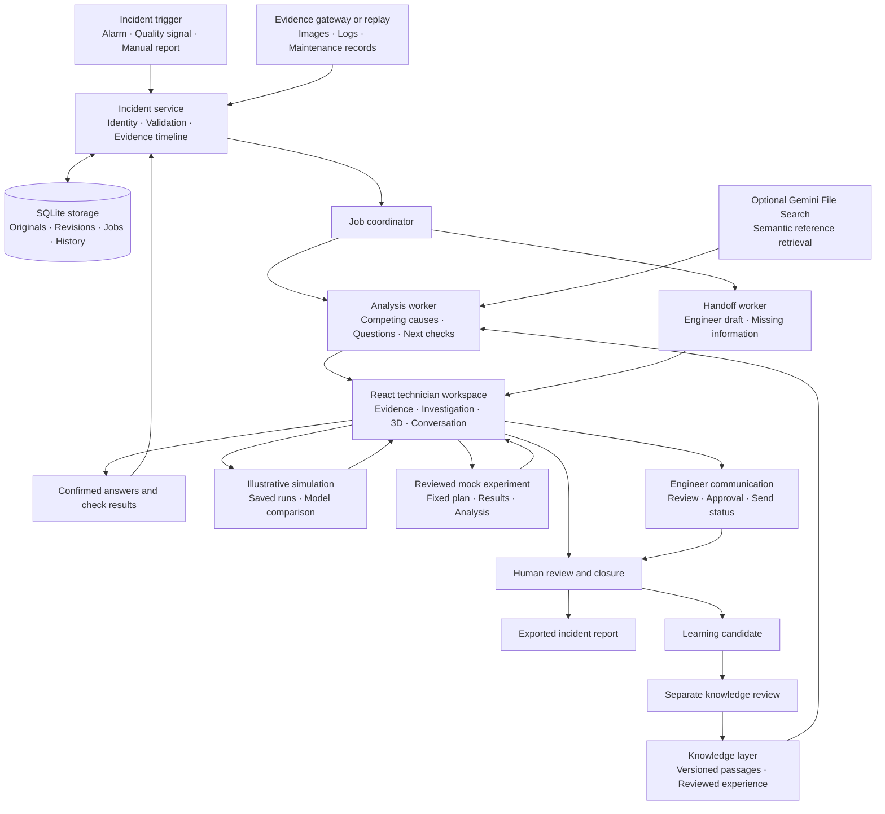

# FLOWPILOT
**An AI Investigation Assistant for Industrial Fluid-Dispensing Defects**

**From incident detection to evidence collection, guided investigation, engineer handoff and reviewed learning.**

## Problem Statement

**The same product defect can come from different machine faults.**

Uneven coating, incomplete coverage or coarse deposits may result from a restricted fluid path, unstable delivery or changes in material condition. Seeing the defect is only the beginning of understanding its cause.

The information needed for troubleshooting is often scattered across inspection images, machine logs, maintenance records and individual experience. Less-experienced technicians may struggle to connect these records, identify a useful next check and explain the situation to an engineer.

FlowPilot addresses this problem by organizing the incident into a shared investigation: **what happened, what evidence exists, what could explain it, what remains unknown and what to check next.**

## User Story

> “As a technician who discovers a dispensing defect, I want to collect the relevant evidence, understand possible failure mechanisms and receive focused investigation guidance, so I can work systematically and give an engineer the full context.”

An engineer needs the same investigation from another perspective:

> “As an equipment engineer, I want an early, structured handoff containing the defect, machine context, evidence, completed checks and unresolved questions, so I can assess the incident without repeating the entire discovery process.”

## Solution Overview

FlowPilot combines an incident database, evidence timeline, diagnostic engine, knowledge retrieval, interactive 3D explanations and engineer communication in one workspace.

The system maintains several possible causes and revises them when new evidence arrives. Analysis and handoff preparation run in parallel, allowing engineering support to begin while investigation continues.

The current project focuses on the **S932 / DJ-2200 / BFS configuration**, with a complete demonstration using synthetic incident records.

## System Architecture: From Start to Finish

### Overall architecture

### 1. Incident input: opening the investigation

The workflow begins with an incident trigger. The input contract supports three origins:

- **Alarm:** an equipment-related event.
- **Image quality:** a reported inspection defect.
- **Manual:** an operator or technician reports a problem.

The incident service records the trigger origin, time, tool identity, equipment configuration and observed symptom. Available production identifiers, such as lot, tray or unit, are included.

A stable incident ID connects every later activity to the same investigation.

Repeated delivery of the same trigger returns the existing incident. Conflicting trigger information is rejected rather than silently replacing the original context.

**Output:** a persisted incident, initial evidence-source statuses and an early handoff template.

In the current demonstration, triggers come from replay or normalized export fixtures. Actual equipment integration requires an approved exporter and verified mapping.

### 2. Evidence collection: preserving the incident context

Evidence enters through the replay workflow, original-file uploads or a read-only export gateway.

The gateway reads **normalized JSONL records**: one structured event per line. An exporter must translate equipment data into this agreed format.

The evidence package can include:

- Last known-good and first known-bad inspection images.
- Machine events and recorded trends.
- Material-change information.
- Recent maintenance records.
- Original supporting files.
- Explicit records that an expected source is unavailable or failed.

A pre-event buffer preserves available records before the trigger. Collection can continue through a configured post-event window.

Evidence matching uses the tool and exact equipment configuration, together with available production scope. Unknown lot or unit information remains unknown.

Collection is progressive: analysis and handoff preparation can start while some sources are still pending.

**Output:** an expanding evidence package with each source marked **Pending, Collected, Unavailable or Failed**.

### 3. Evidence integrity and timeline construction

The backend stores both the original evidence and its structured interpretation.

For original files, the system records the bytes, filename, media type, size, SHA-256 digest, uploader and retention metadata. Evidence records link back to these originals.

Timing information includes the original event time, timezone and any separately recorded clock offset or uncertainty. This allows the timeline to show uncertain ordering when different records cannot be aligned precisely.

Corrections preserve the previous record. A new interpretation or corrected source becomes another recorded version.

The timeline connects:

**Known-good condition → relevant changes → first known-bad condition → investigation activity**

Selecting an event opens its evidence and source context.

**Output:** an inspectable timeline and evidence history that explain what the investigation knew at each stage.

### 4. Incident backend and persistent storage

The **FastAPI backend** coordinates the investigation. It handles incident creation, evidence updates, observations, assessments, simulations, experiments, communication and review.

Typed **Pydantic contracts** validate requests and responses. Generated OpenAPI and TypeScript contracts keep the React interface aligned with the backend.

The prototype uses **SQLite through SQLAlchemy**, with Alembic migrations managing database changes.

Persistent records include:

- Incident context and revisions.
- Evidence and original-file bytes.
- Questions, answers and conversation history.
- Assessment snapshots.
- Background jobs.
- Handoff drafts and communication events.
- Source-document revisions.
- Simulation runs and experiment plans.
- Closure and learning-review history.

Revision checks protect concurrent edits. If an action depends on an outdated incident state, the backend can require a refresh before saving it.

**Output:** a durable investigation that survives page reloads and application restarts.

### 5. Job orchestration: two parallel processing paths

The coordinator schedules two independent background jobs:

**Analysis worker:** examines the incident and updates the diagnostic assessment.

**Handoff worker:** prepares an engineer-facing summary from the available information.

This parallel structure allows a useful handoff to exist before the technician finishes investigating.

Each job is associated with an input fingerprint derived from the relevant incident evidence and observations. This identifies which version of the investigation the job processed.

Jobs have recorded states: **Pending, Running, Succeeded, Failed or Superseded**.

Worker leases and bounded retries support recovery after interruption. If new evidence arrives while an older job is running, stale work is superseded or rejected before it can overwrite the newer investigation.

Human edits to a handoff remain preserved when another generated suggestion becomes available.

**Output:** independently tracked analysis and communication results tied to their source inputs.

### 6. Knowledge retrieval: finding applicable reference information

The knowledge layer supplies document passages and reviewed experience to support the investigation.

The local source registry preserves:

- Document identity and revision.
- Exact passage text and section.
- Equipment applicability.
- Source authority.
- Publication and withdrawal history.
- Review decisions and unresolved conflicts.

This lets the interface show where an explanation or proposed check came from.

Optional **Gemini File Search** provides semantic retrieval over the indexed S932 reference. The importer creates section-aware passages with local revision and passage identifiers. Retrieved citations are resolved back to exact passages in the local registry.

Stale indexes, withdrawn sources and conflicted passages are excluded from subsequent retrieval.

Reviewed historical incidents are retrieved separately using compatibility and publication rules. They provide context about previous investigations.

**Output:** applicable passages and reviewed experience with inspectable citations.

The current indexed S932 reference is an unverified secondary summary. Its presence in retrieval does not make it an approved maintenance procedure.

### 7. Diagnostic analysis: comparing competing causes

The diagnostic engine combines current evidence, confirmed observations and relevant source context.

The implemented S932 investigation compares three mechanisms:

| Possible cause | Mechanism being investigated | Associated components |
|---|---|---|
| **Fluid-path restriction** | A restriction could reduce delivered fluid. | Pickup tube, feed tube, fluid coupling and nozzle. |
| **Unstable fluid delivery** | Variation in supply or connections could produce inconsistent delivery. | Bottle supply, delivery-air path, pickup tube and fluid coupling. |
| **Material-condition change** | Material or idle-related changes could alter flow and coverage. | Bottle, feed tube, dispensing valve and nozzle. |

For each hypothesis, the assessment records its mechanism, supporting evidence, conflicting evidence, missing information and useful next observation.

The current diagnostic baseline uses explicit prototype rules. Optional Gemini processing adds structured explanations, while validated references connect those explanations to recorded inputs.

Rankings are revised as evidence changes. Unknown or contradictory information can keep multiple explanations open or lead to an inconclusive result.

**Output:** a versioned assessment showing what supports each explanation and what could distinguish it from alternatives.

### 8. Adaptive questions, conversation and decision selection

The investigation initially establishes five discovery areas:

**Material · Amount or coverage · Frequency · Recent changes · Location**

Supported information can be prefilled for technician confirmation. Follow-up questions depend on what is already known and which uncertainty remains useful to resolve.

Optional Gemini processing supports natural-language interpretation, explanations and generated questions. Proposed interpretations pass local validation and require technician confirmation before becoming observations.

Optional **Jev** processing supports bounded decisions, such as selecting an eligible question, check, review or escalation option. It also supports answer-readiness assessment and question-purpose classification.

The backend defines eligible options before a provider is called. Invalid outputs, low-confidence selections, timeouts or unavailable providers retain a recorded fallback.

Decision probabilities describe the selected decision task; they are not calibrated probabilities that a machine fault exists.

**Output:** a focused next step and a saved record of how it was selected.

The interface distinguishes **5W2H problem definition**, **causal Why questions** and **hypothesis tests**. A causal chain can stop when supporting evidence runs out.

### 9. Optional voice input: recording technician observations

Technicians can interact using answer cards, typed conversation or optional voice input.

For voice, the backend obtains a single-use ElevenLabs token. The browser streams microphone audio to **ElevenLabs Scribe realtime**, which produces transcript text.

The transcript enters the same conversation and confirmation workflow as typed input:

**Speech → transcript → proposed interpretation → technician confirmation → saved observation**

Hands-free mode can submit committed speech after a pause and accept spoken confirmation. Agent replies remain text.

The incident stores transcript text, input mode, routing metadata and confirmation outcome. Raw microphone audio is not stored by FlowPilot.

**Output:** confirmed observations linked to the original technician wording.

### 10. Visual explanation and illustrative simulation

The **React and Three.js interface** links evidence, hypotheses and machine components.

Selecting a hypothesis highlights the relevant components. Selecting a timeline event exposes explanations that cite that event. A comparison view places two mechanisms side by side.

The schematic distinguishes the liquid-delivery, valve-actuation and atomizing-air paths.

The system separates three information types:

- **Observed:** recorded evidence.
- **Inferred:** an explanation proposed from the evidence.
- **Simulated:** a hypothetical model response.

The simulation service provides bounded synthetic responses for the three implemented mechanisms. Inputs include illustrative fault severity, relative delivery and relative material resistance.

Outputs include relative deposited mass and illustrative coverage over a normalized sequence.

A small regression surrogate is compared with the declared synthetic fixture and a baseline using held-out synthetic conditions. Saved runs retain their parameters, units, model versions, evidence context, assumptions and limits.

**Output:** an understandable mechanism explanation and reproducible hypothetical comparison.

The current simulator uses invented demonstration equations. A calibrated physical model and a validated learned world model remain future development and validation work.

### 11. Checks and experiments: testing the explanation

A proposed check explains which uncertainty it addresses, which hypotheses it distinguishes, the required context and how possible results affect the investigation.

When the technician records a replay check result, the system saves the observation and updates the assessment. Contradictory and inconclusive results remain in the history.

The Experiments page additionally supports a bounded **mock factorial study** over simulator inputs.

An experiment records its competing hypotheses, factors, levels, controls, repetitions, response measure, baseline and stopping conditions. After review, the mock runner executes the fixed planned matrix and saves each result.

Experiment analysis can report a simulated difference or an inconclusive outcome. These outputs remain separate from observed diagnostic evidence.

**Output:** recorded check observations or a reproducible mock experiment with its plan and analysis.

### 12. Engineer handoff and communication

The handoff worker builds a structured draft containing:

- Incident and equipment identity.
- Trigger time and observed defect.
- Known-good and first known-bad boundary.
- Available production scope and recent changes.
- Evidence collected and checks completed.
- Current hypotheses and uncertainty.
- Missing information and requested engineering help.

A local template is available early. Optional Gemini drafting uses the same recorded incident context and retains the evidence manifest.

New findings produce updated suggestions while preserving technician edits.

Communication has a separate lifecycle:

**Draft → Review → Approval → Submission → Acceptance → Delivery → Acknowledgment**

The mock demonstration simulates communication states. An optional configured SMTP adapter supports actual submission with explicit permission, recipient allowlisting and approval of the current snapshot.

Acceptance by an SMTP server, delivery and engineer acknowledgment are stored as distinct events. Uncertain submission failures require resolution before another attempt.

**Output:** an engineer-ready message and a traceable communication history.

### 13. Human review, report export and closure

The reviewer examines the evidence, assessment changes, checks, simulation context and unresolved questions.

An incident can close with a supported finding or an inconclusive outcome. Closure records the conclusion and its supporting context.

The exported Markdown report includes the evidence timeline, investigation history, answers, checks, source revisions, simulations, experiments, communication history and reviewer notes.

Closing the investigation is separate from equipment or production release.

**Output:** a durable report of the investigation and its reviewed outcome.

### 14. Reviewed learning: feeding experience into future investigations

Closure creates a **learning candidate** containing the reviewed summary, outcome, evidence references and source versions.

Knowledge publication is a separate review step. Once approved, compatible future incidents can retrieve that experience with its citation and review history.

If later evidence changes the conclusion, the incident can reopen and stale published learning is withdrawn.

This feedback loop improves the available knowledge corpus through reviewed cases. It does not automatically retrain the external models or establish that a new incident has the same cause.

**Output:** reusable, versioned experience that remains connected to its original evidence.

## Technology and Component Summary

| Layer | Implementation | Responsibility |
|---|---|---|
| Technician interface | React, TypeScript and Vite | Incident navigation, evidence, questions and review. |
| Investigation graph | React Flow | Question branches and investigation progress. |
| 3D explanation | Three.js | Components, fluid paths and mechanism comparison. |
| Backend | Python and FastAPI | Incident workflows, validation and APIs. |
| Contracts | Pydantic, OpenAPI and generated TypeScript | Consistent frontend/backend data structures. |
| Persistence | SQLite and SQLAlchemy | Records, original bytes, jobs and history. |
| Schema management | Alembic | Explicit database migrations. |
| Orchestration | Durable SQLite-backed jobs | Independent analysis and handoff processing. |
| Optional language processing | Gemini | Conversation, interpretation, questions, explanations and drafting. |
| Optional semantic retrieval | Gemini File Search | Reference-document search. |
| Optional bounded decisions | Jev adapter | Eligible next-step selection and classification. |
| Optional speech recognition | ElevenLabs Scribe realtime | Technician voice transcription. |
| Synthetic modelling | NumPy | Illustrative responses and surrogate evaluation. |
| Optional communication | SMTP adapter | Approved engineer-message submission. |

Access permissions and external-data policy apply across these layers. The application distinguishes viewing, editing, experiment authorization, sending, closure, knowledge publication and data management. External processing defaults to synthetic-only data, and provider failures retain visible local fallbacks.

## Expected Impact

**For technicians:** a structured investigation with visible evidence, understandable mechanisms and focused next steps.

**For engineers:** earlier access to incident context, completed checks and unresolved questions.

**For organizations:** consistent investigation records, traceable decisions and reviewed knowledge retained across teams and shifts.

These benefits should be evaluated through evidence completeness, time to a useful engineer handoff, usefulness of suggested checks and technician understanding.

**Current status:** the complete workflow is demonstrated using synthetic S932 incidents. Real equipment connectivity, physical model accuracy, provider usefulness and operational benefits require supervised validation.

Architecture references: [Incident workspace](S932_INCIDENT_WORKSPACE.md), [Evidence gateway](S932_GATEWAY.md), [Reference retrieval](INVESTIGATION_RAG.md), and [Conversation and voice](INVESTIGATION_VOICE.md).
