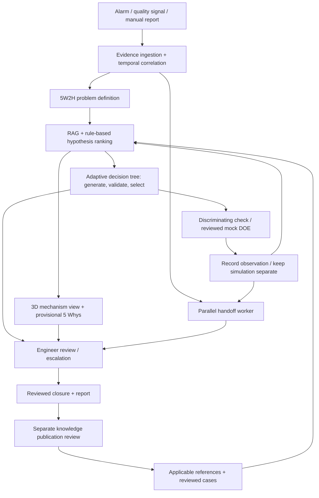

# FlowPilot — Seven-Part Poster and Presentation Content

This draft follows the seven-image reference structure: introduction, user story, problems and needs, system architecture, workflow comparison, bento-box selling points, and financial impact.

---

## [Image #1] — Title / Main Value Proposition

**FLOWPILOT**

### Stop Guessing. Start Investigating.

**Evidence-Led AI Troubleshooting for Industrial Fluid-Dispensing Defects**

From inspection images and machine logs to competing causes, guided checks, and an engineer-ready report.

**One incident. Connected evidence. A clear next step.**

*Visual: FlowPilot’s investigation workspace beside its 3D machine view.*

---

## [Image #2] — User Story: Meet Amir

### MEET AMIR

*An illustrative technician persona.*

Amir is a new maintenance technician supporting a fluid-dispensing line. An inspection flags incomplete coating. He can see the defect—but several different faults could produce the same result.

The inspection image is in one system. Machine events are in another. The last maintenance record is difficult to find, and the experienced engineer is handling another incident.

**He needs to know what changed, what to check next, and what evidence the engineer needs.**

Use three cards:

| **Evidence Everywhere** | **Uncertain Next Step** | **Waiting for Expertise** |
|---|---|---|
| Images, logs, material changes, and maintenance history are scattered. | A restriction, unstable delivery, or material change could explain the defect. | The engineer needs context before offering useful guidance. |

**User story**

> “As a technician, I want to connect the available evidence and follow focused investigation steps, so I can explain the incident clearly and involve the engineer with the right information.”

---

## [Image #3] — Problems & Needs

Use the same three-column **PROBLEMS → NEEDS** layout.

| | **1** | **2** | **3** |
|---|---|---|---|
| **PROBLEMS** | **Fragmented Evidence** | **Uncertain Diagnosis** | **Expertise Bottleneck** |
| **Why it matters** | Separate records make it difficult to reconstruct what happened before the defect appeared. | Similar symptoms can come from different faults; a plausible explanation can lead to the wrong check. | Engineers repeat discovery work, while useful experience stays in individual memory. |
| **NEEDS** | **One Traceable Incident Timeline** | **Competing Causes + Focused Checks** | **Early Handoff + Reviewed Knowledge** |

**Supporting line**

**Connect what happened. Test what could explain it. Preserve what the team learns.**

---

## [Image #4] — System Architecture: How the Logic Works

### FROM DEFECT TO A DEFENSIBLE NEXT STEP

Arrange the main architecture into four columns, with a parallel handoff lane underneath. Use the named methods as the box labels; the explanations below provide the presentation narrative.

| **01 · CAPTURE** | **02 · INVESTIGATE** | **03 · TEST & UPDATE** | **04 · REVIEW & LEARN** |
|---|---|---|---|
| Event-triggered evidence ingestion | 5W2H problem definition | Discriminating hypothesis tests | Human-in-the-loop review |
| Temporal event correlation | Retrieval-Augmented Generation (RAG) | 3D mechanism visualization | Versioned incident report |
| Source provenance and versioning | Rule-based hypothesis ranking | Full-factorial mini-DOE — mock simulator | Reviewed case-based retrieval |
| Last-good / first-bad comparison | Adaptive decision tree + Jev selection | Evidence-bounded 5 Whys + mechanism and verification prompts | Knowledge publication and correction |

### 01 · CAPTURE — Event-triggered ingestion and temporal correlation

An alarm, inspection-quality signal, or technician report creates a persisted incident. **Idempotent trigger handling** associates repeated delivery of the same trigger with the existing incident.

The evidence gateway accepts normalized records and links inspection images, machine events, material changes, and maintenance history by **tool identity, equipment configuration, available production scope, and time**.

**Temporal event correlation** reconstructs the sequence:

**Last known good → Relevant changes → First known bad → Investigation activity**

**Source provenance** preserves original files, timestamps, SHA-256 hashes, and correction history. Uncertain clock alignment and missing records remain visible.

**Output: a versioned incident evidence package and timeline.**

### 02 · INVESTIGATE — 5W2H, RAG, and adaptive decision-tree logic

**A. 5W2H problem definition — establish what happened**

FlowPilot classifies discovery questions using its seven problem-definition categories:

| Category | Purpose | Example prompt |
|---|---|---|
| **What** | Define the observed defect. | What changed in the coating pattern? |
| **Where** | Locate the affected area. | Which lane or product area is affected? |
| **When** | Establish onset, frequency, and sequence. | When did coverage start declining? |
| **Who / Which** | Identify the relevant person, tool, material, or recipe. | Which material and recipe were in use? |
| **Why / Impact** | Establish why the problem matters. | What production or quality impact has been observed? |
| **How detected** | Identify the detection method. | Was the defect detected by inspection, a recorded measurement, or an operator? |
| **How many / much** | Quantify the affected scope or magnitude. | How many units are affected, and how much did deposited mass change? |

These categories organize adaptive discovery; they are not a compulsory seven-question script. **5W2H defines the problem. The separate 5 Whys view explores its possible causes.**

**B. Retrieval-Augmented Generation (RAG) — supply reference context**

The system uses the symptom, configuration, confirmed facts, and active question to retrieve relevant reference passages. Optional **Gemini File Search** supplies semantic retrieval, with citations resolved to exact passages in the local source registry. Reviewed historical cases provide additional context through a separate retrieval path.

**Retrieved passages + incident evidence → Gemini-generated explanations and follow-up candidates → local reference and applicability checks**

Source revision, equipment applicability, and review status determine how a reference may be used.

**C. Rule-based hypothesis ranking — compare competing mechanisms**

The S932 diagnostic baseline compares **fluid-path restriction, unstable fluid delivery, and material-condition change** using explicit heuristic rules. Each hypothesis retains supporting, conflicting, and missing evidence.

For example, falling deposited mass is compatible with all three causes, so that observation alone cannot distinguish them. A recorded unstable-pressure trend adds support for investigating delivery instability.

The ranking expresses investigation priority, not a calibrated probability of a fault.

**D. Adaptive decision tree + bounded Jev selection — choose the next branch**

**Recorded answer → Updated facts and hypotheses → Candidate questions/checks → Eligibility filtering → Selected next node**

With live providers enabled, **Gemini generates candidate questions**. The backend validates their references, prerequisites, and applicability. **Jev selects among the eligible next steps** and can separately assess free-text answer readiness and classify question purpose. Question classification controls labels and colors; it does not establish a cause.

The graph saves answered, active, proposed, and superseded nodes so corrections and alternate branches remain traceable. Local baseline logic keeps the investigation usable when providers are disabled or unavailable.

**Output: a structured problem statement, competing hypotheses, and a justified next question or check.**

### 03 · TEST & UPDATE — Hypothesis discrimination and evidence-bounded causal analysis

**A. Discriminating hypothesis tests — seek an observation that separates causes**

Each proposed check identifies the explanation being examined, the relevant evidence or source method, and how possible results affect the investigation.

The current replay records **Supported / Contradicted / Inconclusive** outcomes, then recomputes the assessment. Conflicting observations remain in the history rather than being overwritten.

**B. 3D mechanism visualization — connect the explanation to components**

Selecting a hypothesis highlights its associated components in the **Three.js 3D view or 2D schematic**. Side-by-side mechanism comparison shows shared and distinct components. Recorded observations, inferred mechanisms, and simulated responses remain separately labelled.

**C. Full-factorial mini-DOE — compare hypothetical responses systematically**

The optional **Design of Experiments (DOE)** workflow defines factors, levels, controls, repetitions, a response measure, and baselines before execution. After review, it runs every planned factor-level combination in the bounded synthetic simulator.

Current factors include illustrative **fault severity, relative delivery, and relative material resistance**. Analysis compares **factor main effects and contrasts against each mechanism’s baseline** for relative deposited mass or coverage. These are mock experiments, not physical machine trials.

**D. 5 Whys + two How prompts — explain and examine the causal chain**

The separate **5 Whys–style causal view** starts with the defect and its proposed physical mechanism, then asks why that condition could have developed. Each link carries evidence or an explicit provisional status. The chain stops when evidence runs out; the current baseline leaves unsupported deeper causes unestablished.

Two supporting prompts make each mechanism actionable for investigation:

- **How does this mechanism produce the defect?** Connect the suspected fault to fluid delivery and the observed coating outcome.
- **How can we verify this explanation?** Identify the observation or check that could support or contradict it.

These mechanism and verification prompts are separate from 5W2H’s **How detected** and **How many / much** categories.

**Output: updated hypotheses, recorded test outcomes, and a causal explanation whose evidence limits remain visible.**

### 04 · REVIEW & LEARN — Human review and case-based retrieval

**Human-in-the-loop review** assesses the evidence, causal explanation, completed checks, and unresolved questions. The reviewer records a supported finding or an inconclusive outcome.

A **versioned incident report** preserves the investigation path and its evidence. Closure creates a learning candidate; separate **knowledge publication review** makes an approved experience available to compatible future incidents.

**Reviewed case → Versioned learning candidate → Publication review → Future case retrieval**

This is **case-based knowledge reuse**. New evidence can reopen an incident and withdraw stale published learning.

**Output: an engineer-reviewed investigation and traceable organizational knowledge.**

### Parallel lane · Asynchronous analysis and handoff orchestration

The coordinator schedules two independent background jobs from the incident context:

- **Analysis worker:** updates hypotheses, questions, and next steps.
- **Handoff worker:** prepares the engineer summary, available evidence, missing information, and requested help.

An **input fingerprint** identifies which evidence revision each job processed. Stale work is superseded, and generated draft updates preserve human edits.

**The engineer handoff starts at incident creation and develops alongside the investigation.**

### Architecture flow

**Concrete example beneath the diagram**

> **5W2H:** Record incomplete coverage, affected location, onset, material/recipe, detection method, impact, and affected quantity where known.
>
> **Hypothesis ranking:** Falling deposited mass and stable recorded pressure keep restriction, delivery instability, and material changes open; the pressure record may miss short transients.
>
> **Adaptive branching:** Select an eligible evidence-comparison question or check to distinguish those explanations. Record whether the result supports, contradicts, or leaves the candidate unresolved.
>
> **5 Whys + How prompts:** Explain how the candidate mechanism could reduce coverage and what would verify it. Leave the deeper reason for that condition unknown until supported.
>
> **Parallel handoff:** Update the engineer’s package with the result, revised assessment, and remaining questions.

*Prototype scope: synthetic S932 incidents, illustrative mechanism models, and mock experiments. Gemini, File Search, and Jev are optional integrations. Methods describe the implemented investigation logic; operational benefits require pilot validation.*

Architecture references: [Incident workspace](S932_INCIDENT_WORKSPACE.md), [5W2H and causal-analysis requirements](S932_AI_Troubleshooting_PRD.md#5-functional-requirements), [reference retrieval](INVESTIGATION_RAG.md), [question-purpose definitions](../apps/api/src/flowpilot/incidents/question_types.py), [diagnostic rules](../apps/api/src/flowpilot/incidents/diagnostic.py), and [mock factorial experiments](../apps/api/src/flowpilot/incidents/experiments.py).

---

## [Image #5] — Comparison: Manual Troubleshooting vs FlowPilot

### FROM REPEATED DISCOVERY TO A SHARED INVESTIGATION

Use two four-step circular diagrams, with the total time in the centre of each.

**Illustrative target scenario: ~80 min manual → ~40 min with FlowPilot.**

*50% less active workflow time at the scenario midpoints; a proposed target, not a measured result.*

### MANUAL WORKFLOW

| **Step** | **Poster label** | **What happens** | **Estimated time** |
|---|---|---|---:|
| **1** | **Collect Evidence** | Record the defect; find images, logs, and maintenance records; reconstruct the timeline. | **20–30 min** |
| **2** | **Search & Diagnose** | Search references, consult experienced colleagues, compare possible causes, and choose a check. | **15–25 min** |
| **3** | **Check & Record** | Complete one applicable check and document its result. | **15–30 min** |
| **4** | **Write & Hand Off** | Assemble the report, review it with the engineer, and save the finding or unresolved status. | **10–15 min** |

**Centre label: ~80 MIN / INCIDENT**

**Planning range: 60–100 minutes.**

*Rework loop: Missing evidence → More questions → Repeat investigation.*

### FLOWPILOT WORKFLOW

| **Step** | **Poster label** | **What happens** | **Target time** |
|---|---|---|---:|
| **1** | **Automated Evidence Correlation** | Ingest images, logs, and incident context; correlate records by equipment identity and time; confirm the consolidated evidence timeline. | **3–5 min** |
| **2** | **Adaptive Diagnostic Reasoning** | Combine 5W2H problem definition, RAG reference retrieval, and rule-based hypothesis ranking; use the adaptive decision tree and optional Jev selection to identify a discriminating check. | **7–10 min** |
| **3** | **Discriminating Hypothesis Testing** | Complete the selected check, record supporting, contradicting, or inconclusive results, and reassess competing mechanisms through evidence-linked reasoning. | **15–30 min** |
| **4** | **Handoff Synthesis & Engineer Review** | Review the structured report generated alongside the investigation, confirm evidence and unresolved questions, and persist the reviewed outcome for subsequent knowledge capture. | **~5 min** |

**Centre label: ~40 MIN / INCIDENT**

**Target range: 30–50 minutes.**

*Reassessment loop: New evidence → Hypothesis reassessment → Handoff synchronization.*

**Parallel lane — Asynchronous Handoff Orchestration:** Independent analysis and handoff workers process the evolving incident during steps 1–3. Step 4 covers engineer review and finalization; background drafting adds no separate step to the total.

### Poster takeaway

**~80 MIN → ~40 MIN**

**Target: halve active investigation and handoff time through connected evidence, guided reasoning, and parallel reporting.**

The check remains **15–30 minutes in both workflows**. The assumed savings come from collecting evidence, finding the next step, and preparing the engineer package.

**Scenario assumptions:** A routine incident with one straightforward check, an available reviewer, prefilled context, configured evidence imports, applicable references, and a generated report requiring only minor edits. This optimistic scenario replaces the earlier 40–70-minute FlowPilot budget; it is not a new benchmark result.

**Timing scope:** Active work through an engineer-ready package and saved finding or unresolved status. Excludes repairs, waiting, spare parts, extra investigation cycles, production requalification, and later knowledge-publication review. Active-work savings do not establish downtime savings. The existing PRD target of **30% less handoff-preparation time** remains a separate pilot metric.

*Poster footnote: Illustrative target scenario; validate with timed, comparable factory incidents.*

---

## [Image #6] — Bento Box: Unique Selling Points

### EVERY DEFECT DESERVES AN EXPLAINABLE INVESTIGATION.

Use the following as individual bento cards.

| **Card label** | **Headline** | **Supporting copy** |
|---|---|---|
| **CONNECTED EVIDENCE** | **One incident. The whole story.** | Bring images, logs, changes, and observations into a shared timeline with source references. |
| **COMPETING CAUSES** | **Keep alternatives visible.** | Show what supports each explanation, what contradicts it, and what remains unknown. |
| **ADAPTIVE INVESTIGATION** | **Ask what matters next.** | Questions and checks change as evidence arrives, helping narrow unresolved possibilities. |
| **3D MECHANISM VIEW** | **See how a fault could cause the defect.** | Highlight relevant components and compare possible failure mechanisms through illustrative 3D/2D views. |
| **PARALLEL HANDOFF** | **Prepare the engineer’s context early.** | Build the handoff during investigation, including missing information and requested help. |
| **VISIBLE UNCERTAINTY** | **Know what is observed—and what is inferred.** | Distinguish recorded evidence, proposed explanations, and simulated results. |
| **REVIEWED LEARNING** | **Carry experience into the next shift.** | Turn reviewed cases into reusable knowledge linked to their original evidence. |
| **VOICE & CONVERSATION** | **Describe the problem in your own words.** | Optional voice and typed interaction capture observations within the investigation. |
| **TRACEABLE REPORTING** | **Keep the reasoning with the result.** | Export the evidence, checks, assessment changes, and unresolved questions together. |

**Largest feature card**

### INVESTIGATE AND ESCALATE IN PARALLEL

The investigation becomes more specific as evidence arrives, while the engineer’s handoff stays aligned with the latest findings.

---

## [Image #7] — Financial Impact

### LESS TIME REBUILDING CONTEXT. MORE TIME RESTORING PRODUCTION.

FlowPilot’s financial opportunity comes from three areas:

| **Value driver** | **How FlowPilot contributes** | **What to measure** |
|---|---|---|
| **Engineering time** | Reduces repeated evidence gathering and handoff preparation | Staff time spent preparing an engineer-usable package |
| **Production availability** | Aims to shorten the path to useful checks and engineering support | Actual downtime avoided on comparable incidents |
| **Repeated investigation effort** | Retains reviewed findings for future cases | Time spent rediscovering previously documented issues |

### Pilot target

**30% less time preparing an engineer-usable handoff**

*Proposed evaluation target; not yet a measured result.*

### Illustrative financial scenario

**What would recovering 15 minutes per incident be worth?**

| Assumption | Illustrative value |
|---|---:|
| Incidents per month | 20 |
| Actual production downtime avoided per incident | 15 minutes |
| Recoverable production value per hour | RM1,000 |
| Production time recovered per month | **5 hours** |
| Potential gross value per month | **RM5,000** |
| Potential gross value per year | **RM60,000** |

**Calculation**

**20 incidents × 15/60 hours × RM1,000 = RM5,000 per month**

*Scenario only: assumes those minutes translate into recoverable production. Figures require factory validation and exclude implementation and operating costs.*

*The 15-minute downtime assumption is independent of Image #5's active-work estimates. Time saved preparing or documenting an investigation does not automatically become production time recovered.*

**Closing statement**

**Connected evidence → More focused investigation → Earlier engineering support → Potentially shorter downtime**

---

## Source references

Draft grounded in FlowPilot’s [current incident workflow](S932_INCIDENT_WORKSPACE.md) and [product requirements](S932_AI_Troubleshooting_PRD.md).
