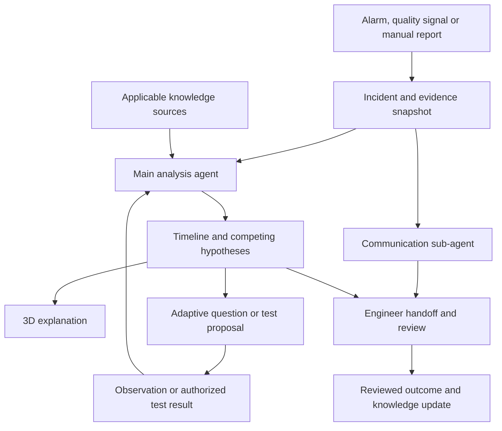

# S932 AI Incident Response and Troubleshooting Assistant

**Product Requirements Document**

**Version:** 0.1 - proposed product definition  
**Date:** 30 September 2026  
**Context:** AI Horizon Solution Challenge 2026 / NSW Automation  
**Initial equipment case:** Asymtek S-932 spray-flux system  
**Basis:** Jia Le's six-step proposal, the challenge brief and the consolidated S-932 reference.

> This PRD describes a proposed product. Requirements, priorities, targets and implementation phases are recommendations for development, not claims that the system already works or that production deployment is approved. The current S-932 knowledge source is a consolidation of AI conversation summaries; controlled manuals, actual machine exports and validated simulation data remain dependencies.

## Contents

- [1. Product summary](#1-product-summary)
- [2. Problem, users and goals](#2-problem-users-and-goals)
- [3. Scope and delivery phases](#3-scope-and-delivery-phases)
- [4. End-to-end incident workflow](#4-end-to-end-incident-workflow)
- [5. Functional requirements](#5-functional-requirements)
- [6. AI components and technical responsibilities](#6-ai-components-and-technical-responsibilities)
- [7. Data and knowledge requirements](#7-data-and-knowledge-requirements)
- [8. Technician and engineer experience](#8-technician-and-engineer-experience)
- [9. Reliability, access and audit requirements](#9-reliability-access-and-audit-requirements)
- [10. Evaluation and acceptance](#10-evaluation-and-acceptance)
- [11. Demonstration case and challenge alignment](#11-demonstration-case-and-challenge-alignment)
- [12. Milestones, dependencies and open decisions](#12-milestones-dependencies-and-open-decisions)
- [13. Sources and decision provenance](#13-sources-and-decision-provenance)

## 1. Product summary

Build an AI assistant that responds to a dispensing incident by collecting machine evidence, preparing engineer escalation in parallel, reconstructing a visible timeline, explaining possible failure mechanisms in a 3D machine view, and guiding the technician through questions and approved tests that distinguish competing causes.

The intended experience is an incident workspace where a technician can see **what was recorded, what may explain it, what evidence is missing and what to check next**. Engineers receive the same evidence and the investigation history without waiting for the technician to complete root-cause analysis alone.

The central diagnostic principle is that **similar product defects can arise from different machine faults**. A useful diagnosis must therefore change in response to evidence and test results. The product should support confirmation, contradiction and an unresolved outcome rather than always selecting a root cause.

The complete vision includes a world model informed by machine data and physical relationships. The proposed first prototype uses a limited, explicit 3D simulation while the team establishes the data and validation needed for learned physical prediction.

### 1.1 The original six-step idea, organized

| Step | Proposed capability | Intended benefit |
|---|---|---|
| 1 | A fault trigger causes the central control-link PC to collect good/bad images, machine logs and recent PM records | Reduce manual evidence collection and preserve incident context |
| 2 | The main agent analyzes evidence while a communication sub-agent drafts a structured help email | Reduce delay in involving an engineer |
| 3 | Build a detailed incident timeline connected to a 3D machine sandbox | Make the event sequence and affected components visible |
| 4 | Use physical relationships and a world model to explore material flow, movement and possible failure mechanisms | Help technicians understand how a fault could produce the observed defect |
| 5 | Ask adaptive questions, use Five Whys and two How prompts, and evaluate branches with Jev before selecting a discriminating test or mini-DOE | Separate causes that produce similar symptoms |
| 6 | Retrieve applicable best-known methods and retain reviewed outcomes | Make recommendations traceable and improve future investigations |

## 2. Problem, users and goals

### 2.1 Problem statement

During an equipment incident, useful evidence can be distributed across machine logs, inspection images, material records and maintenance systems. A less-experienced technician may recognize the defect without understanding its physical cause or knowing what information an engineer needs. Changes made during troubleshooting can also remove evidence or make it unclear which action affected the outcome.

The challenge brief calls for preliminary troubleshooting through questions, ranked causes, explanations, an action sequence and a report [S1]. This proposal adds automatic incident evidence capture, parallel engineer handoff, a visual explanation and an iterative test-and-update workflow.

### 2.2 Users

| User | Need | Primary interaction |
|---|---|---|
| Operator or new technician | Understand the incident and collect useful observations | Review images, answer focused questions, see component locations and escalate |
| Qualified maintenance technician | Investigate component or system faults within their authorization | Review hypotheses, approved check prerequisites and measured results |
| Process/equipment engineer | Receive context quickly and assess the investigation | Review the evidence package, authorize applicable tests and confirm findings |
| Knowledge owner or tool owner | Maintain correct procedures and applicability | Review sources, approve case knowledge and manage versions |

Site-specific qualifications and authority must be configured from the site's own policy; these product roles do not grant machine-work permission.

### 2.3 Goals

- Shorten the time from incident detection to a useful engineer handoff.
- Preserve the last-good/first-bad boundary and the events around it.
- Explain ranked hypotheses using inspectable evidence and relevant source passages.
- Help inexperienced technicians understand the relationship between a component and the defect.
- Reduce unnecessary or inconclusive checks by choosing questions/tests that distinguish causes.
- Retain reviewed investigation outcomes and source versions for future retrieval.

### 2.4 Product boundaries

The first release provides investigation support. It does not autonomously change machine parameters, clear interlocks, execute maintenance, release production material or authorize tool return to production. It does not promise an exact reconstruction of an unobserved failure. Email sending is a separate permission-controlled action from drafting.

S-932 is the initial case study. Supporting NSW or other dispensing equipment later requires new connectors, configuration definitions and verified procedures; machine rules are not assumed portable.

## 3. Scope and delivery phases

**Priority definitions:** P0 = required for the demonstrable prototype; P1 = supervised pilot capability; P2 = later expansion or research. This sequencing is a recommended implementation plan, not a removal of the original vision.

| Capability | P0 prototype | P1 supervised pilot / P2 expansion |
|---|---|---|
| Incident input | Replay/import one incident package; simulated alarm and manual trigger clearly labelled | P1 read-only live event/image/PM connectors and rolling evidence buffer |
| Engineer handoff | Parallel email draft with linked evidence; no live send required | P1 approved recipient routing, sending and delivery/acknowledgment tracking |
| Diagnosis | One defect family with at least three competing causes | P1 broader reviewed cases; P2 additional equipment/configurations |
| Timeline | Correlated images, logs and PM events with missing-data indicators | P1 live updates and time-synchronization validation |
| 3D view | Simplified material-path model, highlighted components and explicit hypothetical animations | P1 measured/calibrated subsystem model; P2 evaluated learned world model |
| Adaptive questions | Approximately five initial discovery fields, then branching questions | P1 evaluation and refinement on reviewed incident cases |
| Decision component | Jev adapter if accessible; deterministic fallback and recorded model status | P1 benchmark against rules and an LLM on the same held-out cases |
| Tests | Proposed discriminating check with recorded/replayed result | P1 authorized physical execution; formal mini-DOE where appropriate |
| Knowledge | Searchable source passages, applicability and evidence status | P1 controlled originals and approved BKM publication workflow |
| Output | Incident report and escalation draft export | P1 integration into the site's existing incident process |

**Prototype completion:** A user can progress through one incident from trigger to a supported or unresolved conclusion, inspect the evidence behind each change, review the 3D explanation and export an engineer-ready package. No actual machine connectivity or learned physics accuracy is implied by replay mode.

## 4. End-to-end incident workflow

1. **Detect and open:** An alarm, inspection-quality signal or operator report creates an incident. Repeated triggers are associated with the existing incident where appropriate.
2. **Preserve and collect:** The gateway freezes the available pre-event history and gathers the configured post-event window. Images, logs and recent maintenance records retain their original identifiers and timestamps. Collection continues as analysis starts.
3. **Run parallel work:** The main agent begins evidence analysis. The communication sub-agent creates a draft using known facts and marks missing information. Neither waits for a final diagnosis.
4. **Construct the timeline:** Align records by tool, lot/tray/unit and time. Show uncertain ordering, missing events and clock offsets instead of manufacturing a precise sequence.
5. **Retrieve and reason:** Search relevant sources, filter for configuration and approval status, then build competing hypotheses with supporting, conflicting and missing evidence.
6. **Explain visually:** Selecting a hypothesis highlights the associated subsystem and shows a possible mechanism. The viewer distinguishes recorded observations from inferred or simulated states.
7. **Ask and discriminate:** Ask the next useful question or propose an approved check. Record the technician's original answer, interpretation and confidence in the observation. Update hypotheses from the result.
8. **Review and close:** An authorized reviewer records the finding and recovery evidence. Unresolved incidents may remain escalated or be closed as inconclusive; a confirmed cause is not mandatory.
9. **Capture learning:** A reviewed case is proposed for the knowledge base. Publishing changes requires knowledge-owner review and preserves prior versions.

The knowledge base supports the investigation from step 5 onward and can supply relevant context during initial triage. Learning at closure is a separate operation from retrieval.

### 4.1 Parallel workflow

### 4.2 Investigation state

Use **Open → Evidence collecting → Investigating → Review → Closed** as the main lifecycle. “Waiting for observation,” “Waiting for test authorization,” “Waiting for engineer” and “Blocked by missing data” are explicit substates. Escalation can occur at any stage. Evidence arriving after a draft or decision creates a new version without overwriting the record of what was known earlier.

Machine operating state, production-hold state and incident state are separate. Closing an incident must not itself release the machine or material.

## 5. Functional requirements

### 5.1 Incident capture and evidence

| ID | Requirement | Acceptance criterion |
|---|---|---|
| FR-01 | Accept alarm, image-quality and manual incident triggers | Each trigger records origin, time, tool/configuration and a stable incident ID; duplicate delivery does not create duplicate work |
| FR-02 | Collect an incident package progressively | Every expected source is marked collected, unavailable, pending or failed; analysis and drafting can start with partial evidence |
| FR-03 | Preserve good/bad comparison and production scope | Record last known-good and first known-bad images at the finest available unit/tray granularity, with lot context; absence of a known-good record remains explicit |
| FR-04 | Preserve raw evidence and timing | Retain original timestamps, time zone, ingestion time, file/record identity, units and integrity reference; inferred clock corrections are separately recorded |
| FR-05 | Correlate recent changes | Link PM, valve/nozzle/material changes, recipe changes and setup/calibration events when records exist; unmatched records are not silently assigned to a tool |

The live buffer duration, look-back windows and retention policy are configuration decisions to be agreed with the tool/data owner. A collector cannot recover pre-event information that was never logged or retained.

### 5.2 Parallel engineer communication

| ID | Requirement | Acceptance criterion |
|---|---|---|
| FR-06 | Start the communication sub-agent when the incident opens | A structured draft becomes available before root-cause confirmation and identifies unknown fields |
| FR-07 | Keep the handoff synchronized | New material findings create an updated draft/version associated with the same incident; previous sent content remains recorded |
| FR-08 | Separate draft, approval, send and delivery status | A draft is never shown as sent; sending follows configured authorization and verified recipients; retry does not send duplicates |

The draft must contain incident ID, tool/configuration, trigger and time, observed defect, last-good/first-bad boundary, potentially affected scope, relevant recent changes, checks completed, current hypotheses clearly labelled, missing evidence, requested engineering help and accessible evidence links. Severity follows site rules or human assessment rather than an invented downtime or loss estimate.

Proposed subject format: **[Severity] [Tool ID] - [Observed symptom] - [Incident ID]**. The LLM writes the draft; the decision component may classify routing or urgency. No message is sent simply because the draft agent finishes.

### 5.3 Timeline, diagnosis and 3D explanation

| ID | Requirement | Acceptance criterion |
|---|---|---|
| FR-09 | Provide an evidence-linked timeline | Selecting an event opens its source; uncertain order and missing intervals remain visible |
| FR-10 | Maintain competing hypotheses | Each hypothesis records mechanism, supporting/conflicting evidence, unknowns and next distinguishing observation; the UI can show “insufficient evidence” |
| FR-11 | Explain rankings and updates | A changed rank identifies the new observation and its effect; missing measurements are not treated as normal readings |
| FR-12 | Provide a synchronized 3D subsystem view | Users can select a component, inspect its role, scrub the incident timeline and compare candidate mechanisms |
| FR-13 | Label visual evidence status | Every displayed state is marked Observed, Inferred or Simulated; animation assumptions and unavailable measurements are accessible |
| FR-14 | Record simulation inputs and applicability | A replay records model/version, parameters, evidence references, assumptions and validity limits; unsupported scenarios cannot be presented as verified reconstructions |

Prototype 3D scope is the reported bottle/BFS, tubing/QDs, valve, nozzle, air cap and substrate relationship. Separate liquid delivery, valve actuation and atomizing-air paths. Geometry can be schematic if labelled; part dimensions and fluid parameters must not be invented and presented as measured values [S3, Sections 2 and 13].

### 5.4 Adaptive questions, Jev and experiments

| ID | Requirement | Acceptance criterion |
|---|---|---|
| FR-15 | Cover initial problem discovery | Cover material, amount/coverage, frequency, recent changes and location; prefilled evidence is shown for confirmation rather than asked repeatedly |
| FR-16 | Select informative follow-up questions | Each question states which uncertainty it addresses; answers include Unknown/Not measured; different observations produce meaningfully different branches |
| FR-17 | Use bounded decision outputs | Jev or the fallback selects among defined questions/checks/abstain/escalate options; all choices are filtered by applicability and authorization rules |
| FR-18 | Distinguish 5W2H problem definition from Five-Why causal analysis | Color and label each question by its purpose. Use What, Where, When, Who/Which, Impact, How detected and How many/much for problem definition; distinguish hypothesis tests and causal Why questions. Establish a supported physical mechanism before extending the causal chain; unsupported steps remain hypotheses and the chain can stop before five Whys |
| FR-19 | Propose discriminating tests or a mini-DOE | Record hypotheses distinguished, source method, prerequisite state, responsible role, measured response, expected outcomes and stopping conditions |
| FR-20 | Feed results back into diagnosis | Store the observed result and conditions, update hypotheses and draft/report, and retain contradictory or inconclusive outcomes |

**Clarified terminology:** 5W2H defines the problem; 5 Whys investigates deeper causes after identifying a supported physical failure mechanism. Preserve the source's problem-definition prompts—What, Where, When, Which, How many, How detected and Impact—while allowing Who/Which where appropriate. Mechanism and verification explanations remain supporting details, not substitutes for 5W2H's two H categories. Jev may classify generated question purpose; the saved category affects presentation only and never establishes a cause or changes the selected branch.

A formal mini-DOE additionally specifies factors, permitted levels, controlled variables, repetitions and the analysis plan. The system must not invent machine settings or repeatedly test until a desired answer appears. An initial inspection or existing measurement may resolve a question without a physical experiment. Tests run on equipment require the site's authorized method and role.

### 5.5 Knowledge and reporting

| ID | Requirement | Acceptance criterion |
|---|---|---|
| FR-21 | Retrieve applicable source passages | Show document ID, revision, page/section, configuration and approval status alongside each proposed action; missing applicability blocks an operational instruction |
| FR-22 | Manage conflicting and secondary sources | Preserve conflicting passages and unresolved status; conversation summaries cannot silently become approved BKMs |
| FR-23 | Generate a versioned incident report | Export problem, evidence/timeline, ranked hypotheses, rationale, questions, tests/results, current conclusion, source references and engineer notes |
| FR-24 | Support reviewed learning | A candidate case records reviewer, outcome, source versions and changes; knowledge publication requires review, retains history and supports withdrawal |

## 6. AI components and technical responsibilities

These are logical responsibilities; the implementation need not create a separate model instance for every row.

| Component | Responsibility | Output |
|---|---|---|
| Read-only gateway on/alongside control-link PC | Collect permitted events, files and associated records | Normalized evidence plus preserved originals |
| Incident coordinator | Track state, schedule parallel work and manage versions/retries | Consistent incident record |
| Main analysis agent / LLM | Interpret evidence and documents, form hypotheses and explain changes | Evidence-linked diagnosis and next-step proposals |
| Communication sub-agent / LLM | Prepare and update the engineer handoff | Versioned draft |
| Vision component | Compare images and extract defect observations | Features/annotations with confidence and image references |
| Jev decision component | Evaluate bounded routing or next-question/check choices | Typed selection and uncertainty information |
| Rule and authorization checks | Enforce configuration, source status and permitted actions | Eligible actions, blocking reasons and escalation |
| Simulation/world-model service | Predict or illustrate subsystem behaviour within a stated domain | Scenario, assumptions and validation information |
| 3D renderer | Display components, timelines and alternative mechanisms | Interactive explanation |
| Retrieval and case store | Index controlled knowledge and reviewed incidents | Relevant passages/cases with provenance |

### 6.1 Jev selection and fallback

TypeSafe's current documentation describes Jev as accepting text and returning typed decisions/probabilities; it does not generate prose explanations and does not currently accept image/video input. The same documentation states that calibration does not guarantee an individual answer is correct [S4]. Accordingly, image observations need a separate extraction stage and explanations remain evidence-grounded LLM/reporting work.

Treat Jev as a candidate component to evaluate, with its model/version and input/output recorded. Do not claim it is the world's fastest or most accurate model for this domain. Compare it against a deterministic baseline and an LLM on identical reviewed cases. If unavailable or uncertain, retain the incident and use the declared fallback or engineer review; do not conceal the substitution.

### 6.2 World-model development path

The world model is intended to help predict how a subsystem behaves under a specified state/action and compare mechanisms. General world-model research, including V-JEPA 2's visual prediction and robotic planning demonstrations, motivates investigation; it does not validate S-932 spray physics [S5].

Recommended progression:

1. **Schematic explanation:** manually defined component relationships and animations, labelled hypothetical.
2. **Calibrated subsystem simulation:** measured pressure/mass/geometry/material relationships, documented assumptions and known limits.
3. **Learned world model:** trained or adapted using permitted machine observations, action/result records and suitable simulated data; evaluated on held-out operating conditions.

Promotion to diagnostic use requires a defined measurable prediction task, validation data separated from development data, comparison with a simple baseline and an agreed error tolerance. Perceived visual realism is not the validation criterion. No model may infer a hidden measured value simply to fill a missing sensor channel.

## 7. Data and knowledge requirements

### 7.1 Minimum incident entities

| Entity | Required information |
|---|---|
| Incident | ID, tool/configuration, trigger, creation time, state, owner and mode: live/replay/synthetic |
| Evidence | ID, original source, event/ingestion time, time zone, asset/lot/tray/unit association, units, integrity reference and availability status |
| Observation | Finding, evidence links, author/model, extraction confidence and human confirmation where applicable |
| Hypothesis | Mechanism, support, contradiction, unknowns, rank/status and version |
| Question/answer | Prompt, purpose, original answer, structured interpretation and associated evidence |
| Test plan/result | Source procedure, approvals, conditions, response definition, result and interpretation |
| Simulation | Model/version, inputs, assumptions, scenario, output and validity status |
| Communication | Draft/version, recipients, approval/send/delivery status and incident association |
| Reviewed case | Conclusion or inconclusive outcome, reviewer, verification evidence and knowledge-publication status |

Candidate S-932 inputs include mass, fluid/valve/coaxial pressure, recipe/setup/calibration events, valve/material identity, material age, I/O states, images and maintenance history. Their actual export availability is not established. Instantaneous nozzle flow, needle travel and solenoid response should not be assumed present [S3, Section 13].

### 7.2 Knowledge status

Distinguish **controlled procedure**, **reviewed case**, **secondary conversation summary** and **simulation/example**. Authority also depends on revision and configuration applicability. Operator observations are valuable evidence but are not themselves maintenance procedures.

The current consolidated reference can seed the equipment vocabulary, hypothesis catalogue, source register and review backlog. Its numeric limits and procedures must remain unverified until matched to controlled originals [S3, Sections 1, 11 and 18].

## 8. Technician and engineer experience

The main incident workspace contains:

- **Incident summary:** status, affected tool/material scope, current evidence completeness and next action.
- **Good/bad comparison:** aligned images with labels, original-image access and comparison limitations.
- **Timeline:** source-linked events, changes and uncertain time ordering.
- **3D panel:** component highlighting, mechanism comparison and visible evidence-status labels.
- **Hypotheses and questions:** supporting/conflicting evidence, one clear question at a time and an Unknown option.
- **Test card:** purpose, approved source, prerequisites, role, expected observations and result entry.
- **Engineer handoff:** editable draft, missing information and communication status.

Use plain-language explanations with technical detail available on demand. Avoid making animation playback a prerequisite for escalation. Show a useful partial result when a connector/model fails. Technicians can correct observations without losing the original record.

## 9. Reliability, access and audit requirements

| ID | Requirement | Expected behaviour |
|---|---|---|
| NFR-01 | Progressive response | Acknowledge the incident promptly; show partial results and explicit pending work |
| NFR-02 | Resilient orchestration | Communication drafting and investigation can continue independently; retries are idempotent and do not duplicate incidents/sends |
| NFR-03 | Read-only equipment integration | Prototype and initial pilot do not issue machine-control commands |
| NFR-04 | Role-based access | Separate viewing, editing observations, test authorization, email sending, closure and knowledge publication |
| NFR-05 | Data handling | Send logs/images to external model services only through permitted deployments and data policies; configure retention, deletion and access auditing |
| NFR-06 | Source and input isolation | Treat retrieved documents/logs as evidence, not instructions that can override application permissions or trigger tool actions |
| NFR-07 | Auditability | Preserve model/source versions, evidence used, changed hypotheses, human corrections and approvals |
| NFR-08 | Degraded operation | Mark missing images, stale measurements, uncertain timestamps and failed retrievals; never substitute fabricated evidence |

## 10. Evaluation and acceptance

All numeric targets below are **proposed prototype goals**, not measured performance or production service commitments. Record the hardware, model versions, network conditions and incident-package size used to evaluate them. Pilot targets require engineering agreement.

| Measure | Definition | Proposed criterion |
|---|---|---|
| Incident acknowledgement | Trigger received to incident visible | p95 at most 2 seconds in the replay benchmark |
| Initial handoff draft | Trigger received to usable partial draft | p95 at most 15 seconds in the replay benchmark; missing fields explicitly marked |
| Evidence traceability | Explanatory claims with valid supporting references / claims requiring evidence | 100% in the reviewed acceptance scenarios |
| Operational-source gate | Actionable machine instructions based only on unverified/inapplicable sources | Zero in the acceptance suite; such cases escalate or request sources |
| Visual honesty | Inferred/simulated states shown without a visible status label | Zero in the acceptance suite |
| Diagnostic usefulness | Engineer-rated hypothesis quality and next-check usefulness on held-out incidents | Must improve on or justify replacing the declared baseline; set pass threshold after case review |
| Handoff efficiency | Time to prepare an engineer-usable package versus manual preparation on matched cases | Pilot objective: at least 30% reduction, to be tested |
| Technician understanding | Correct explanation of suspected mechanism and next observation after using the tool | Compare with the current text-based workflow; report observed results |

Measure abstention, false confident conclusions, tests required, and outcomes on unresolved cases alongside accuracy. Split evaluation cases by incident so near-duplicate images/logs from the same incident cannot appear in both development and evaluation sets. Synthetic/replayed cases establish workflow behaviour, not production diagnostic accuracy or downtime savings.

### 10.1 Acceptance scenarios

| ID | Scenario | Required result |
|---|---|---|
| AT-01 | Same trigger arrives twice | One incident; no duplicate draft/send action (FR-01, FR-08) |
| AT-02 | PM record unavailable | Missing-data status; analysis and partial draft continue (FR-02, FR-06) |
| AT-03 | Logs and images have mismatched clocks | Timeline shows uncertainty or recorded correction (FR-04, FR-09) |
| AT-04 | Similar image defect supports several causes | Multiple hypotheses and a distinguishing question/test (FR-10, FR-16, FR-19) |
| AT-05 | Technician answers Unknown | No invented observation; alternate evidence request or escalation (FR-16) |
| AT-06 | Jev is unavailable or below the decision threshold | Declared fallback/abstention; action filters still apply (FR-17) |
| AT-07 | Test result contradicts the leading cause | Ranking changes with the evidence link and history preserved (FR-11, FR-20) |
| AT-08 | Procedure is for another configuration or is conversation-only | Operational instruction is blocked pending an applicable approved source (FR-21, FR-22) |
| AT-09 | A simulated internal restriction is displayed | Label and assumptions remain visible; not represented as an observed fault (FR-13, FR-14) |
| AT-10 | Email is drafted but sending fails/is unauthorized | Status remains draft/failed; no false delivery claim (FR-08) |
| AT-11 | Engineer closes an inconclusive investigation | Preserve unresolved hypotheses and findings without inventing a confirmed cause (FR-23) |
| AT-12 | New learning is submitted | Candidate case enters review; approved BKM is not overwritten automatically (FR-24) |

## 11. Demonstration case and challenge alignment

### 11.1 Illustrative incident

Use an explicitly labelled replay with progressively insufficient coverage. Start with three candidate causes from the current reference: a fluid-path restriction, unstable fluid delivery/pressure, and a material-condition change. These candidates are for demonstrating the investigation pattern, not a validated diagnosis of an actual incident [S3, Section 5].

Show good/bad images, a recent change, pressure/mass records where present and an incomplete PM record. The agent prepares the email while the timeline develops. The 3D view compares mechanisms. A targeted question and a recorded result from an engineer-reviewed check narrow the possibilities or leave the case unresolved. The final report identifies exactly what supports its conclusion.

If using a synthetic test result, label it prominently and do not imply that an experiment was performed on the real machine. Demonstrate actual live sending only if that action and recipient are separately authorized.

### 11.2 Two-minute prototype demonstration

| Time | Demonstration |
|---|---|
| 0:00-0:20 | Trigger the replay; show evidence collection and parallel draft creation |
| 0:20-0:45 | Compare images and inspect the timeline/recent change |
| 0:45-1:10 | Inspect competing hypotheses and the 3D mechanism view |
| 1:10-1:40 | Answer a question, inspect a proposed check and load its labelled result |
| 1:40-2:00 | Show the changed conclusion, evidence/source links and exportable handoff/report |

This uses the two-minute demo slot in the supplied briefing deck [S2]. Keep a replay/offline fallback and distinguish it from a live-equipment demonstration.

### 11.3 Required challenge outcomes

| Challenge requirement [S1] | Product response |
|---|---|
| Approximately five initial discovery questions | Five discovery fields with evidence-assisted confirmation |
| Identify the defect | Image/observation-supported defect description |
| Analyze and rank possible causes | Versioned hypothesis list with supporting/conflicting evidence |
| Explain the confidence/ranking | Evidence-based rationale; numerical probability only when justified and calibrated for the task |
| Logical troubleshooting action plan | Applicable next question/check/test with prerequisites and source |
| Troubleshooting report | Exportable incident report and engineer notes |
| Adaptive questions, images and historical cases | Integrated into the incident loop and reviewed knowledge store |

The differentiating claim to demonstrate is **a traceable investigation that becomes more specific as evidence arrives, while engineers are involved early and technicians receive a visual explanation**. Judge value through the workflow and observed results rather than model names alone.

## 12. Milestones, dependencies and open decisions

No calendar commitments are assigned because team capacity, equipment access and submission deadlines have not been established in this PRD.

| Milestone | Deliverable and exit condition |
|---|---|
| M0 - Evidence contract | Agree one tool/configuration, one defect family, data availability, source status and reviewer; identify missing originals |
| M1 - Incident foundation | Import/replay package, correlated timeline, progressive collection and parallel email draft |
| M2 - Diagnostic loop | Source retrieval, competing hypotheses, adaptive questions, decision adapter/fallback and recorded test-result update |
| M3 - Visual prototype | Schematic 3D subsystem and hypothesis comparison with evidence-status labels |
| M4 - Demonstrable MVP | Required acceptance scenarios pass; complete two-minute replay and report export |
| M5 - Supervised pilot | Approved data connectors, controlled procedures, authorized physical checks and measured outcomes |
| M6 - World-model validation | Defined prediction task, adequate data, baseline comparison and accepted validation results |

| Open decision / dependency | Proposed owner role | Why it matters |
|---|---|---|
| Exact S-932 configuration and available APIs/exports | Tool owner / integration engineer | Determines what the gateway can actually observe |
| Controlled manuals, BKMs and permitted usage | Knowledge owner | Determines which operational recommendations can be enabled |
| Meaning of “5 WHY and 2 HOW” | Product proposer / process engineer | Confirms the questioning method |
| Initial defect family and labelled cases | Process/equipment engineer | Sets a feasible first diagnostic scope |
| CAD/schematic assets and measured physical parameters | Tool owner / simulation developer | Determines the fidelity of the 3D model |
| World-model family and validation target | AI/simulation developer with engineer | Prevents animation quality being mistaken for physical accuracy |
| Jev access, deployment policy and baseline evaluation | AI developer / data owner | Determines whether it is appropriate and usable |
| Engineer recipient routing and send authorization | Operations owner | Enables fast, controlled communication |
| Approved checks and any DOE factor limits | Qualified engineering owner | Defines permissible experiments and interpretation |
| Incident retention, clock alignment and model data access | Site IT / data owner | Determines trustworthy correlation and permitted processing |

The roles above are proposed responsibilities, not assigned individuals or confirmed commitments.

## 13. Sources and decision provenance

| ID | Source | Used for |
|---|---|---|
| S0 | Jia Le's six-step proposal in this conversation | Product vision: automatic collection, parallel escalation, timeline/3D, world model, adaptive questioning/Jev/tests and learning |
| S1 | NSW Automation .pdf, supplied challenge brief | Required preliminary-troubleshooting outcomes and bonus capabilities |
| S2 | AI Horizon Solution Challenge - Briefing Deck.pdf | Presentation/demo format and judging context |
| S3 | Asymtek_S932_Consolidated_Reference.md, edition 1.0, 30 September 2026 | Candidate hardware/defects/data, RCA structure, source limitations and unresolved configuration details |
| S4 | [TypeSafe AI: System One documentation](https://docs.typesafe.ai/concepts/system-one), checked 30 September 2026 | Jev input/output boundaries and confidence limitation |
| S5 | [Meta: V-JEPA 2 research publication](https://ai.meta.com/research/publications/v-jepa-2-self-supervised-video-models-enable-understanding-prediction-and-planning/), checked 30 September 2026 | Research context for visual prediction and robotic planning; not S-932 validation |

S3 is derived from ast_info2.md, nyra-chat-conversation.md, ast_spec_manual1.md and ast_spec_manual2.md. It is not independent evidence that their referenced manuals were retrieved or that their procedures are approved.

The priority levels, functional IDs, acceptance scenarios, proposed performance targets and delivery sequence are PRD design recommendations introduced here. They remain reviewable as the team obtains actual data and engineering input.
